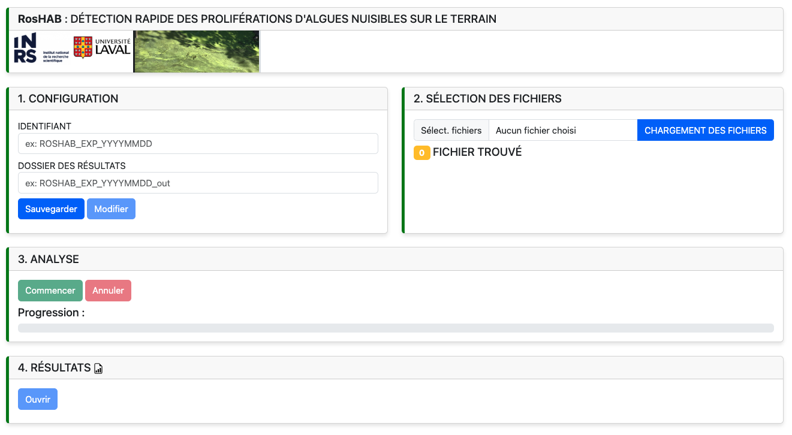

[](https://www.nextflow.io/)
[](https://www.docker.com/)
[](https://sylabs.io/docs/)

## Introduction

```
  ____           _   _    _    ____         ____ _     ___ 
 |  _  \___  ___| | | |  / \  | __ )       / ___| |   |_ _|
 | |_) / _ \/ __| |_| | / _ \ |  _ \ _____| |   | |    | | 
 |  _ < (_) \__ \  _  |/ ___ \| |_) |_____| |___| |___ | | 
 |_| \_\___/|___/_| |_/_/   \_\____/       \____|_____|___|


 Taxonomic classification of ONT reads with Kraken2 and minimap2
 with a focus on bloom-forming microorganisms.

     Github: https://github.com/dsamoht/roshab-wf

~~~~~~~~~~~~~~~~~~~~~~~~~~~~~~~~~~~~~~~~~~~~~~~~~~~
```
# Installation
### Dependencies

- [Nextflow](https://www.nextflow.io/)  
- [Docker](https://www.docker.com/)
- A pre-built [Kraken2 database](https://benlangmead.github.io/aws-indexes/k2)

- __Edit__ *nextflow.config* :  
  ```  
  kraken_db = '/absolute/path/to/extracted/kraken2/database'
  ```
### Run the pipeline
> *__Note__* : the first execution will download container images for future use
```
nextflow run main.nf -profile setup
```

### To run on your data
```
nextflow run main.nf --help
```

### GUI (Currently in development)  


